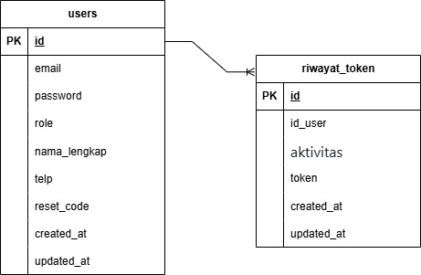

# API Dokumentasi Auth

## Deskripsi

API ini adalah auth untuk project aplikasi Donation

## Base URL

```text
https://donation-api-auth.vercel.app/
```

## Database Schema

```text
butuh tabel sql
```

<!--  -->

## ERD



Dari gambar database diatas, sistem auth terdiri dari beberapa tabel utama:

- **users**: Menyimpan data login dan detail user
- **riwayat_token**: Menyimpan data riwayat penggunaan token

## Endpoints

#### 1. Registrasi akun baru

- **Method:** POST
- **Path:** `/auth/register`
- **Content-Type:** application/json

##### Request Body

```json
{
  "email": "dermawan@gmail.com",
  "password": "dermawan123",
  "nama_lengkap": "Dermawan Saputra",
  "telp": "081234567890",
  "role": "user"
}
```

- **Role:** "user" / "volunteer"

##### Response Success

- **Status Code:** 201 Created
- **Content-Type:** application/json

```json
{
  "success": true,
  "message": "Akun berhasil dibuat",
  "data": {
    "id": 1,
    "email": "dermawan@gmail.com",
    "nama_lengkap": "Dermawan Saputra",
    "telp": "081234567890",
    "role": "user",
    "created_at": "2025-05-20T14:30:00.000Z",
    "updated_at": "2025-05-20T14:30:00.000Z"
  }
}
```

##### Response Error

- **Status Code:** 400 Bad Request
- **Content-Type:** application/json

```json
{
  "success": false,
  "message": "Data registrasu akun tidak lengkap",
  "errors": ["Email harus diisi"]
}
```

#### 2. Login akun

- **Method:** POST
- **Path:** `/auth/login`
- **Content-Type:** application/json

##### Request Body

```json
{
  "email": "dermawan@gmail.com",
  "password": "dermawan123"
}
```

##### Response Success

- **Status Code:** 200 OK
- **Content-Type:** application/json

```json
{
  "success": true,
  "message": "Berhasil Login",
  "data": {
    "id": 1,
    "email": "dermawan@gmail.com",
    "nama_lengkap": "Dermawan Saputra",
    "telp": "081234567890",
    "role": "user",
    "token": "JWTTOKEN"
  }
}
```

##### Response Error

- **Status Code:** 400 Bad Request
- **Content-Type:** application/json

```json
{
  "success": false,
  "message": "Data login akun tidak lengkap",
  "errors": ["Email harus diisi"]
}
```

- **Status Code:** 401 Unauthorized
- **Content-Type:** application/json

```json
{
  "success": false,
  "message": "Email atau password tidak sesuai"
}
```

#### 3. Verifikasi Token

- **Method:** POST
- **Path:** `/auth/verify-token`
- **Content-Type:** application/json

##### Request Body

Authorization: Bearer {token}

<!-- ```json
{
  "email": "dermawan@gmail.com"
}
``` -->

##### Response Success

- **Status Code:** 200 OK
- **Content-Type:** application/json

```json
{
  "success": true,
  "message": "Token valid",
  "data": {
    "id": 1,
    "email": "dermawan@gmail.com",
    "nama_lengkap": "Dermawan Saputra",
    "telp": "081234567890",
    "role": "user"
  }
}
```

##### Response Error

- **Status Code:** 401 Unauthorized
- **Content-Type:** application/json

```json
{
  "success": false,
  "message": "Token akses diperlukan"
}
```

- **Status Code:** 401 Unauthorized
- **Content-Type:** application/json

```json
{
  "success": false,
  "message": "Token tidak valid atau telah kedaluwarsa"
}
```

- **Status Code:** 500 Internal Server Error
- **Content-Type:** application/json

```json
{
  "success": false,
  "message": "Error saat memverifikasi token",
  "error": ["Terjadi kesalahan pada server"]
}
```

#### 4. Lupa Password

- **Method:** POST
- **Path:** `/auth/forgot-password`
- **Content-Type:** application/json

##### Request Body

```json
{
  "email": "dermawan@gmail.com"
}
```

##### Response Success

- **Status Code:** 200 OK
- **Content-Type:** application/json

```json
{
  "success": true,
  "message": "Request ubah password berhasil, silahkan cek email anda",
  "data": {
    "email": "dermawan@gmail.com"
  }
}
```

##### Response Error

- **Status Code:** 400 Bad Request
- **Content-Type:** application/json

```json
{
  "success": false,
  "message": "Data input tidak lengkap",
  "errors": ["Email harus diisi"]
}
```

#### 5. Verify lupa Password

- **Method:** PATCH
- **Path:** `/auth/forgot-password/verify?code={unique code}`
- **Content-Type:** application/json

##### Request Body

```json
{
  "password": "dermawan001"
}
```

##### Response Success

- **Status Code:** 200 OK
- **Content-Type:** application/json

```json
{
  "success": true,
  "message": "Berhasil mengganti password",
  "data": {
    "email": "dermawan@gmail.com"
  }
}
```

##### Response Error

- **Status Code:** 400 Bad Request
- **Content-Type:** application/json

```json
{
  "success": false,
  "message": "Data input tidak lengkap",
  "errors": ["Password harus diisi"]
}
```

#### 6. Menambah Riwayat token baru

- **Method:** POST
- **Path:** `/auth/riwayat-token`
- **Content-Type:** application/json

##### Request Body

```json
{
  "id_user": "{id_user}",
  "aktivitas": "Create Token",
  "token": "JWTTOKEN"
}
```

##### Response Success

- **Status Code:** 200 OK
- **Content-Type:** application/json

```json
{
  "success": true,
  "message": "Berhasil mengganti password",
  "data": {
    "email": "dermawan@gmail.com"
  }
}
```

##### Response Error

- **Status Code:** 400 Bad Request
- **Content-Type:** application/json

```json
{
  "success": false,
  "message": "Data input tidak lengkap",
  "errors": ["id_user harus diisi harus diisi"]
}
```

## Status Kode

| Status Code | Description                                              |
| ----------- | -------------------------------------------------------- |
| 200         | OK - Permintaan berhasil                                 |
| 201         | Created - Data berhasil dibuat                           |
| 400         | Bad Request - Parameter tidak valid atau tidak lengkap   |
| 401         | Unauthorized - Autentikasi diperlukan                    |
| 403         | Forbidden - Tidak memiliki izin untuk mengakses resource |
| 404         | Not Found - Resource tidak ditemukan                     |
| 500         | Internal Server Error - Kesalahan pada server            |

## Struktur Database

### Tabel users

| Field        | Tipe                               | Deskripsi                          |
| ------------ | ---------------------------------- | ---------------------------------- |
| id           | INT                                | Primary Key, Auto Increment        |
| email        | VARCHAR(100)                       | Email User                         |
| password     | VARCHAR(32)                        | Password                           |
| role         | enum('user', 'volunteer', 'admin') | Role user                          |
| nama_lengkap | VARCHAR(100)                       | Nama lengkap user                  |
| telp         | VARCHAR(15)                        | Nomor telepon user                 |
| created_at   | TIMESTAMP                          | Waktu pembuatan akun               |
| updated_at   | TIMESTAMP                          | Waktu terakhir pembaruan data akun |

### Tabel riawayat_token

| Field      | Tipe         | Deskripsi                             |
| ---------- | ------------ | ------------------------------------- |
| id         | INT          | Primary Key, Auto Increment           |
| id_user    | INT          | Foreign Key ke tabel users            |
| aktivitas  | VARCHAR(100) | Detail aktivitas user                 |
| token      | TEXT         | JWT token yang digunakan              |
| created_at | TIMESTAMP    | Waktu pembuatan data riwayat          |
| updated_at | TIMESTAMP    | Waktu terakhir pembaruan data riwayat |
